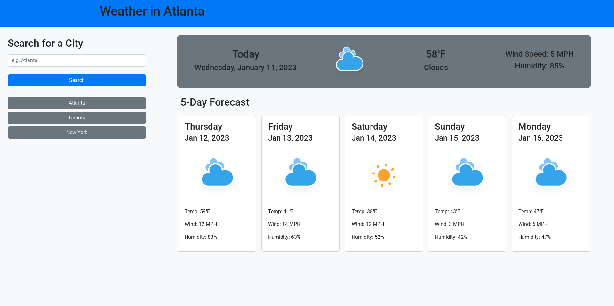

# Weather App
Weather application using OpenWeatherMap API, Bootstrap, and Day.js

## Link
https://jason-lieb.github.io/weather-app/

## Screenshot

## Future Additions
* Better Font / Colors
* More Responsive Design
* Input validation for search function
* Error handling for API requests
* Use Current Location
* Support for both imperial and metric units
* Add searching by hitting enter when done typing input
* Add loading symbol before data is retrieved

## Sources
Icons from amCharts under Creative Commons

## Installation
N/A

## Usage
N/A

## License
Please refer to the LICENSE in the repo